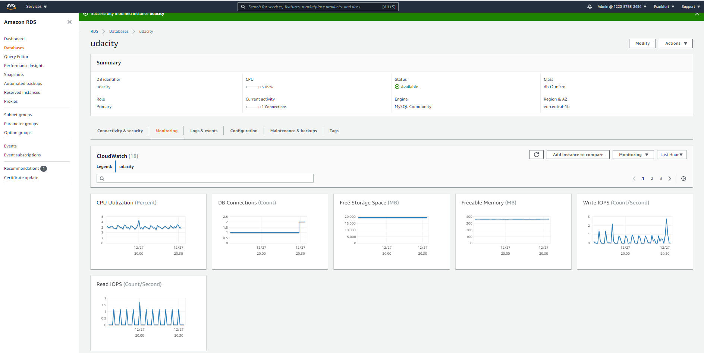
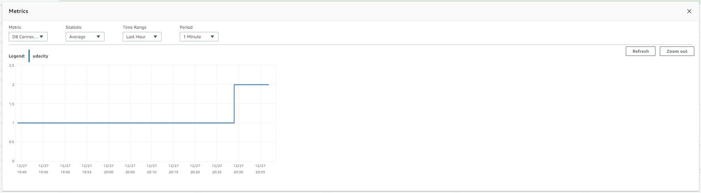
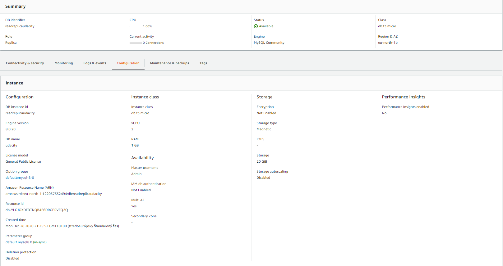
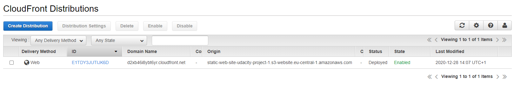

# Data durability and recovery

In this project you will create highly available solutions to common use cases.  You will build a Multi-AvailabilityZone, Multi-Region database and show how to use it in multiple geographically separate AWS regions.  You will also build a website hosting solution that is versioned so that any data destruction and accidents can be quickly and easily undone.

## Getting Started

To get started, clone this repo.  Aside from instructions, it contains a CloudFormation script to build an AWS VPC with public and private subnets.  It also contains an example website that you will host in an AWS S3 bucket in your account.

## Project Instructions
### Cloud formation
In this project, you will use the AWS CloudFormation to create Virtual Private Clouds. CloudFormation is an AWS service that allows you to create "infrastructure as code". This allows you to define the infrastructure you'd like to create in code, just like you do with software. This has the benefits of being able to share your infrastructure in a common language, use source code control systems to version your infrastructure and allows for documenting and reviewing of infrastructure and infrastructure proposed changes.

CloudFormation allows you to use a configuration file written in a YAML file to automate the creation of AWS resources such as VPCs. In this project, you will use a pre-made CloudFormation template to get you started. This will allow you to create some of the infrastructure that you'll need without spending a lot of time learning details that are beyond the scope of this course.

You can find the YAML file in the GitHub repo: https://github.com/udacity/nd063-c2-design-for-availability-resilience-reliability-replacement-project-starter-template/blob/master/cloudformation/vpc.yaml

In order to build a VPC from the YAML file, follow the steps:

1. Services -> CloudFormation
2. Create stack “With new resources (standard)”
3. Template is ready
4. Upload a template file
5. Click “Choose file” button
6. Select provided YAML file
7. Next
8. Fill in Stack name
9. Name the VPC
10. Update the CIDR blocks
11. Click Next
12. Click Next again
13. Click Create stack
14. Wait for the stack to build out.  Refresh until status becomes “CREATE_COMPLETE”
15. Observe the “Outputs” tab for the created IDs.  These will be used later.

Once the CloudFormation Stack has completed, you can look at the "Resources" tab to see all of the AWS resources that the stack has created.  You can see both the type of resources that have been created, as well as the AWS identifiers for those resources so that you can locate these resources in the AWS service that they are a part of.

The "Outputs" tab shows you custom output from the CloudFormation Stack that is labeled and described for you.  These descriptions are custom descriptions that were added to the CloudFormation template and make it easier for you to find specific values that have been created as a part of the CloudFormation stack.  Here, you can find the VPC ID that has been created, the subnet IDs including which subnets are public and which are private, and the Security Groups that have been created and a description of each.

### Part 1
Complete the following steps:
### Data durability and recovery
In order to achieve the highest levels of durability and availability in AWS you must take advantage of multiple AWS regions. 
1. Pick two AWS regions. An active region and a standby region.
2. Use CloudFormation to create one VPC in each region. Name the VPC in the active region "Primary" and name the VPC in the standby region "Secondary".

**NOTE**: Be sure to use different CIDR address ranges for the VPCs.
**SAVE** screenshots of both VPCs after they are created. Name your screenshots: primary_Vpc.png, secondary_Vpc.png

### Highly durable RDS Database
1. Create a new RDS Subnet group in the active and standby region.
2. Create a new MySQL, multi-AZ database in the active region. The database must:
     - Be a “burstable” instance class.
     - Have only the “UDARR-Database” security group.
     - Have an initial database called “udacity.”
3. Create a read replica database in the standby region. This database has the same requirements as the database in the active region. 

**SAVE** screenshots of the configuration of the databases in the active and secondary region after they are created. 
**SAVE** screenshots of the configuration of the database subnet groups as well as route tables associated with those subnets. Name the screenshots: primaryDB_config.png, secondaryDB_config.png, primaryDB_subnetgroup.png, secondaryDB_subnetgroup.png, primaryVPC_subnets.png, secondaryVPC_subnets.png, primary_subnet_routing.png, secondary_subnet_routing.png

### Estimate availability of this configuration
Write a paragraph or two describing the achievable Recovery Time Objective (RTO) and Recovery Point Objective (RPO) for this Multi-AZ, multi-region database in terms of:

1. Minimum RTO for a single AZ outage
2. Minimum RTO for a single region outage
3. Minimum RPO for a single AZ outage
4. Minimum RPO for a single region outage

**SAVE** your answers in a text file named "estimates.txt"

### Demonstrate normal usage
In the active region:
1. Create an EC2 keypair in the region
2. Launch an Amazon Linux EC2 instance in the active region. Configure the instance to use the VPC's public subnet and security group ("UDARR-Application"). 
3. SSH to the instance and connect to the "udacity" database in the RDS instance. 
4. Verify that you can create a table, insert data, and read data from the database. 
5. You have now demonstrated that you can read and write to the primary database

**SAVE** the log of connecting to the database, creating the table, writing to and reading from the table in a text file called "log_primary.txt"

### Monitor database
1. Observe the “DB Connections” to the database and how this metric changes as you connect to the database
2. Observe the “Replication” configuration with your multi-region read replica. 

**SAVE** screenshots of the DB Connections and the database replication configuration. Name your screenshots: monitoring_connections.png, monitoring_replication.png

### Part 2
### Failover And Recovery
In the standby region:

1. Create an EC2 keypair in the region
2. Launch an Amazon Linux EC2 instance in the standby region. Configure the instance to use the VPC's public subnet and security group ("UDARR-Application").
3. SSH to the instance and connect to the read replica database.
4. Verify if you are not able to insert data into the database but are able to read from the database.
5. You have now demonstrated that you can only read from the read replica database.

**SAVE** log of connecting to the database, writing to and reading from the table in a text file called "log_rr_before_promotion.txt"

**SAVE** screenshot of the database configuration now, before promoting the read replica database in the next step. Name your screenshot: rr_before_promotion.png

6. Promote the read replica
7. Verify that if you are able to insert data into and read from the read replica database.
8. You have now demonstrated that you can read and write the promoted database in the standby region.

**SAVE** log of connecting to the database, writing to and reading from the database in a text file named "log_rr_after_promotion.txt"

**SAVE** screenshots of the database configuration after the database promotion. Name your screenshot: rr_after_promotion.png

### Part 3
### Website Resiliency

Build a resilient static web hosting solution in AWS. Create a versioned S3 bucket and configure it as a static website.

1. Enter “index.html” for both Index document and Error document
2. Upload the files from the GitHub repo (under `/project/s3/`)
3. Paste URL into a web browser to see your website. 

**Save** the screenshot of the webpage. Name your screenshot "s3_original.png"
You will now “accidentally” change the contents of the website such that it is no longer serving the correct content

You will now “accidentally” change the contents of the website such that it is no longer serving the correct content

1. Change `index.html` to refer to a different “season”
2. Re-upload `index.html`
3. Refresh web page

**SAVE** a screenshot of the modified webpage. Name your screenshot "s3_season.png"

You will now need to “recover” the website by rolling the content back to a previous version.

1. Recover the `index.html` object back to the original version
2. Refresh web page

**SAVE** a screenshot of the modified webpage. Name your screenshot "s3_season_revert.png"

You will now “accidentally” delete contents from the S3 bucket. Delete “winter.jpg”

**SAVE** screenshots of the modified webpage and of the existing versions of the file showing the "Deletion marker". Name your screenshots: s3_deletion.png, s3_delete_marker.png

You will now need to “recover” the object:

1. Recover the deleted object
2. Refresh web page

**SAVE** a screenshot of the modified webpage. Name your screenshot "s3_delete_revert.png"

## Recoverability in AWS - FINISHED PROJECT

Below is description finalized project based on specification.

### Relational Database Resilience

1. SWBAT build networks that will continue to operate through the loss of a single data center

Primary VPC was created from cloudformation script:

Secondary VPC was created from cloudformation script:

2. SWBAT build systems that align to a business availability objectives for redundancy.

Configuration of Primary RDS is:

Primary RDS subnet group is:

Subnets in subnet group:

Routing tables for  configured database subnets are:

3. SWBAT build systems that align to business availability objectives for resiliency.

Configuration of read replica is:

Secondary RDS subnet group is:

Subnets details:

Subnets route tables details:

### Manage applications in AWS

1. SWBAT predict the availability of a configuration

Solution is in "./estimates.txt" file.

2. SWBAT use correct data access patterns.

Logs between Primary RDS and EC2 are in ./log_primary.txt.

Logs between Secondary RDS and EC2 before promotion are in ./log_rr_before_promotion.txt.

Note: VPC peering is setup, thats why we can use same EC2.

3. SWBAT monitor highly available system

Monitoring details of Primary RDS after connections from EC2:

Database replica configuration:

4. SWBAT operate a highly resilient database

Logs between Secondary RDS and EC2 before promotion are in ./log_rr_before_promotion.txt.

Secondary RDS configuration before promotion:

Logs between Secondary RDS and EC2 after promotion are in ./log_rr_after_promotion.txt.

Secondary RDS configuration after promotion:

### Website recovery

1. SWBAT create a versioned website

Screenshot of the website with a winter scene as the background and displaying a timestamp:

2. SWBAT recover from “accidental” modification to website

Screenshot of same website with a different season (picture) as the background, still displaying a timestamp:

Screenshot of AWS S3 object “index.html” showing multiple versions of the object exist:

Screenshot of the same website once again with the original background, still displaying a timestamp:

Screenshot of the same website with no background image:

Screenshot of AWS S3 object “winter.jpg” showing multiple versions of the object exist with the latest being a “deletion marker”:

Screenshot of the same website once again with the original background, still displaying a timestamp:

### Suggestions to Make Your Project Stand Out!

1. Student creates RDS database via CloudFormation or Terraform

Cloudfromation script with Primary RDS is in ./cloudformation/primary_vpc.yaml.

Cloudfromation script with Read replica of RDS is in ./cloudformation/secondary_vpc.yaml

Configuration of Primary RDS through AWS Console after creation is below:

Configuration of Read replica of Primary RDS through AWS Console after creation is below:

2. Student sets up VPC peering between the two regions

Routing tables for subnets in both VPCs needed to be changed after VPC peering. Example of route table change in one of those subnets is below:

Because I wanted to create connection between EC2 in primary region and Secondary RDS in secondary region I needed also change security group for Secondary RDS. See below:

3. Student sets up S3 bucket behind a CloudFront distribution

I created CloudFront for S3 bucket. Settings are below:

To verify CloudFront is working, I deleted content in S3 bucket and tried to visit S3 bucket web site endpoint and Cloudfront endpoint.

Empty S3 bucket below:

## License

## HOW TO

Subpart with HOW to links.

### How to enable permissions for S3 static web hosting:

<https://docs.aws.amazon.com/AmazonS3/latest/dev/WebsiteAccessPermissionsReqd.html>

### How to recover to previous state of object:

1. aws s3api get-object --bucket static-web-site-udacity-project-1 --key index.html --version-id xlp5uHFhsGU7foCXGxrX4m9TtsgsDbiH  index-version1.html
2. aws s3api put-object --bucket static-web-site-udacity-project-1 --key index.html --body index-version1.html --acl public-read --content-type text/html
{
    "ETag": "\"d28fae6944e056e777980636d7118cd2\"",
    "VersionId": "R7V7j1rehbgbSLzzxShk.JfwD9GhAwAP"
}
Note: dont forget set "--content-type text/html". If you will not, webside will not work.

### How to undelete deleted object

<https://docs.aws.amazon.com/AmazonS3/latest/user-guide/undelete-objects.html>

### How to setup CloudFront + S3 bucket

<https://app.pluralsight.com/course-player?clipId=7cf86902-5c52-454f-915b-1db49042d690>

### How to Disaster recovery

Minimum RTO for a single AZ outage:

Try to reboot RDS with failover and you can see how long does it take for the secondary AZ database to become active. Refer this link on how to reboot the database with failover: <https://docs.aws.amazon.com/AmazonRDS/latest/UserGuide/USER_RebootInstance.html>

Single AZ outage in multi-AZ deployment: There exists synchronous replication in case of multi AZ deployments. Whenever one AZ fails, automatic failover takes place. RTO and RPO are very less in this case.
Refer this link to understand more about multi-AZ deployments: <https://aws.amazon.com/rds/features/multi-az/>

Single region outage in multi-region deployment: If one region fails, we have to promote the read replica to take place of master database. This requires manual intervention. Also, there exists asynchronous replication in this case. Thus, RTO and RPO are slightly greater in this case.
Refer this link to understand more about RTO and RPO for RDS: <https://aws.amazon.com/blogs/database/implementing-a-disaster-recovery-strategy-with-amazon-rds/>

